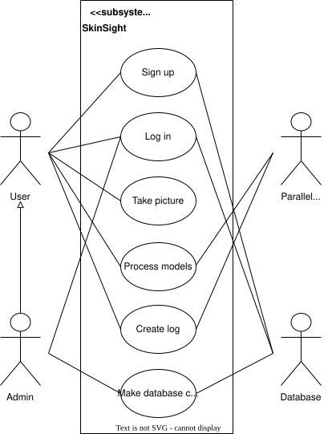
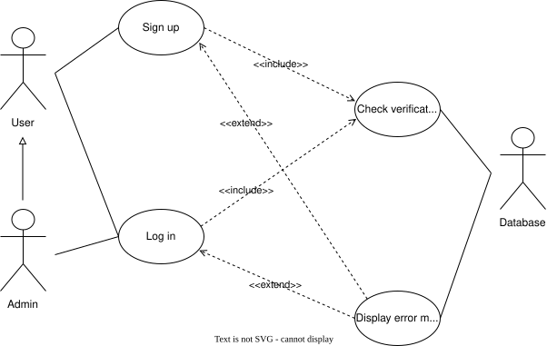
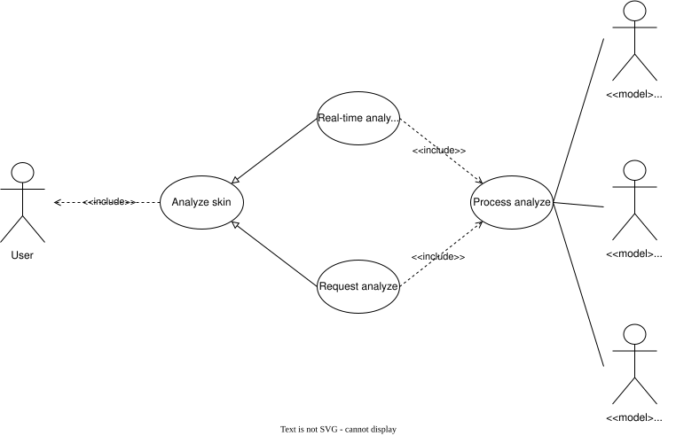
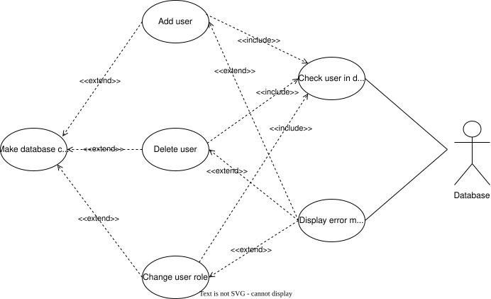
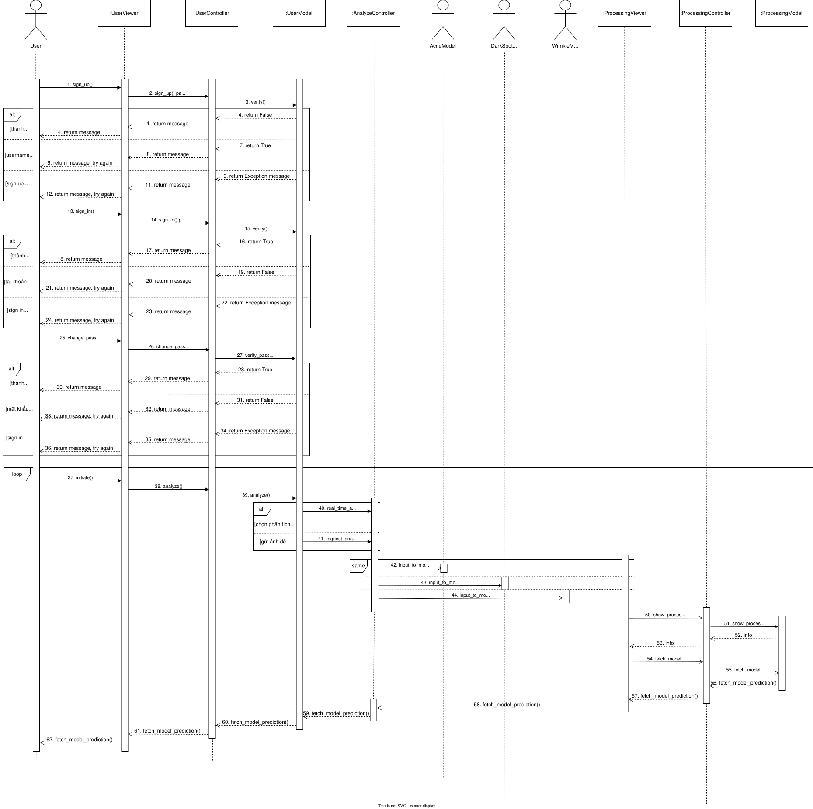
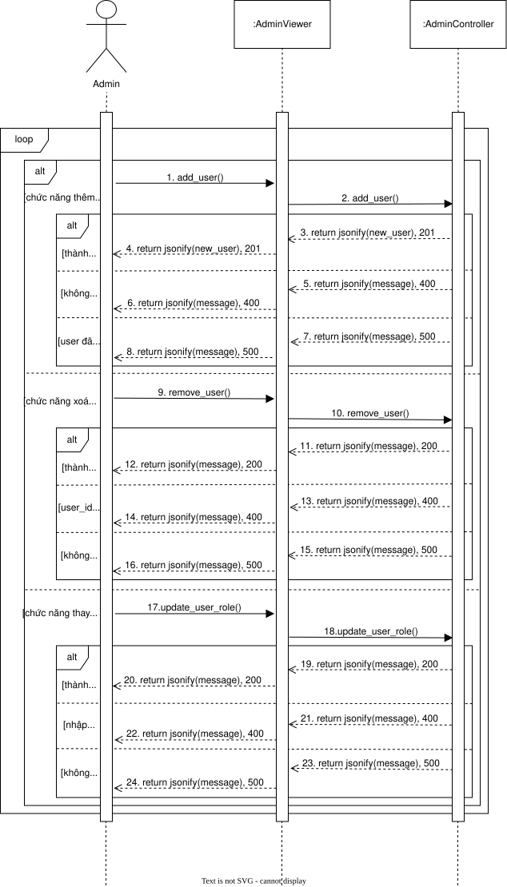
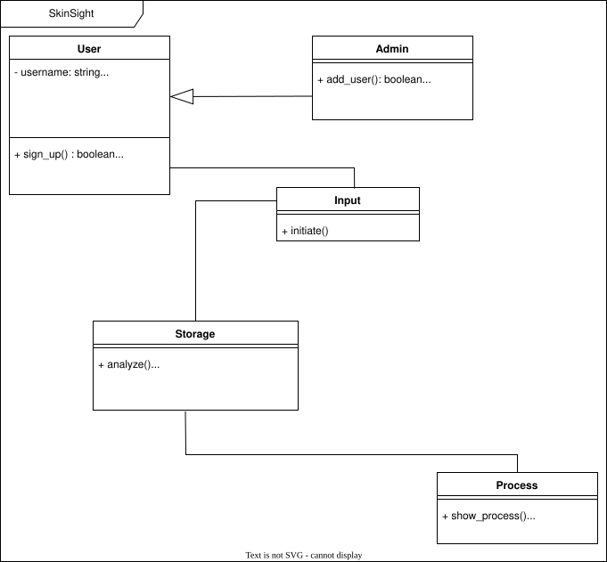
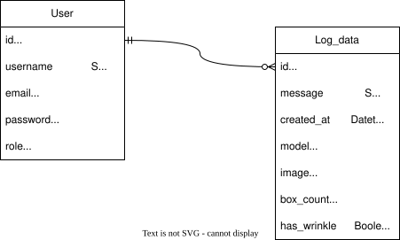

# SkinSight

_Ứng dụng phân tích làn da_

<div align="center">

[](https://docs.google.com/document/d/1mo_M7fOjziYH-977mjpAKFkQWEb9PR8xqTluGkaoTtY/edit?usp=sharing)
[](https://docs.google.com/document/d/1AFmHesKPbabxM99TgXOndiUx_cYlhLNPNqHa93nguaw/edit?usp=sharing)
[](https://docs.google.com/document/d/1yaEVHGXHC0jvZEk4yoto34OpL79w65XG75FAujEyQxY/edit?usp=sharing)

</div>

## Table of Contents

- [About](#about)
- [Designing](#designing)
- [Run the app](#run-the-app)
- [Contributors](#contributors)

## About

SkinSight là một sản phẩm của nhóm 5 sinh viên thuộc UET-VNU, sử dụng công cụ AI để phân tích làn da với những thông số cụ thể. Người dùng khi sử dụng ứng dụng này có thể biết được tình trạng da mặt như độ mụn, nám đen, nếp nhăn, độ lão hoá

Thứ giúp cho Skinsight khác biệt so với những sản phẩm cùng chức năng là giao diện được thiết kế khoa học, tối giản, đồng thời sử dụng một mô hình học máy cho phép ứng dụng thực hiện phân tích một cách nhanh chóng và toàn diện, một số tính năng tiêu biểu như:

-  Khả năng chạy song song trên 3 image mô hình khác nhau để cho ra kết quả nhanh, chính xác với từng loại
-  Hệ thống được tích hợp với camera của người dùng, giúp việc dự đoán theo thời gian thực trở nên nhanh chóng
-  Tính năng chọn trong kho ảnh nếu không thể truy cập camera
-  Hỗ trợ tạo ra 1 log về các vấn đề phát hiện được của tình trạng làn da
-  Hỗ trợ tiếng Việt cho toàn bộ người dùng
-  Hệ thống cơ sở dữ liệu bảo mật

## Designing

Trong quá trình thiết kế ứng dụng, để giúp nắm bắt rõ hơn, nhóm đã tạo ra một số thiết kế biểu đồ, bao gồm:

- **Use Case Diagram** dùng để khái quát toàn bộ các ca sử dụng trong một lần khởi chạy ứng dụng của người dùng, gồm có:

  + ***Top Level Use Case***

<!-- Screenshots -->
<p align="center">
  
</p>

  + ***Sign up and Log in Use Case***

<!-- Screenshots -->
<p align="center">
  
</p>

  + ***Analyze skin Use Case***

<!-- Screenshots -->
<p align="center">
  
</p>

  + ***Make database changes Use Case***

<!-- Screenshots -->
<p align="center">
  
</p>

- **Sequence Diagram** để khai quát toàn bộ quá trình khởi động ứng dụng cho đến hết ca làm việc, cho cả người dùng lẫn quản trị viên:

<!-- Screenshots -->
<p align="center">
  
</p>

<!-- Screenshots -->
<p align="center">
  
</p>

- **Class Diagram** để khai quát hệ thống các lớp, hàm được sử dụng, các attribute và method của mỗi lớp:

<!-- Screenshots -->
<p align="center">
  
</p>

- **ERD Diagram** để khái quát mối quan hệ giữa các Table trong Database

<!-- Screenshots -->
<p align="center">
  
</p>

## Run the app

1. Clone repository của dự án và chuyển đến thư mục chứa dự án
```bash
git clone https://github.com/hungp2812/ai_project.git
cd ai_project
```
2. Chạy lệnh sau để pull tất cả image từ Docker Hub
```bash
./dockerpull_all.sh
```
3. Sau khi pull xong, chạy docker compose để khởi động hệ thống
```bash
docker-compose up -d
```
4. Mở trình duyệt tùy chọn và truy cập ứng dụng qua <http://localhost:3000>

## Contributors

Nhóm phát triển dự án bao gồm 5 thành viên:
- Trần Xuân Bảo
- Phạm Quốc Hùng
- Nguyễn Khánh Tùng
- Phan Tuấn Hiệp
- Phan Hoàng Dũng
